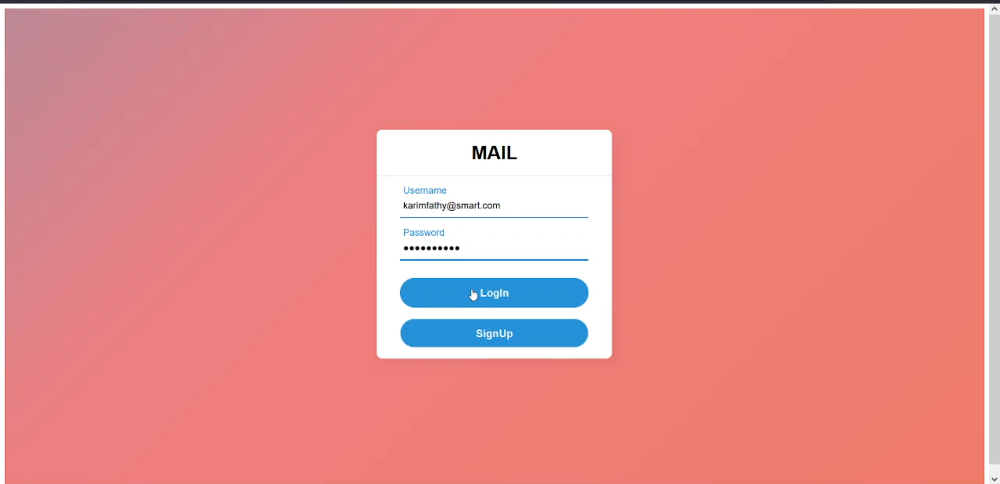
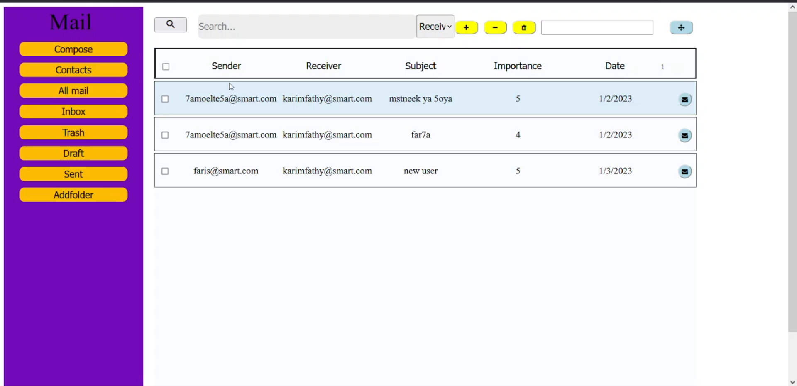
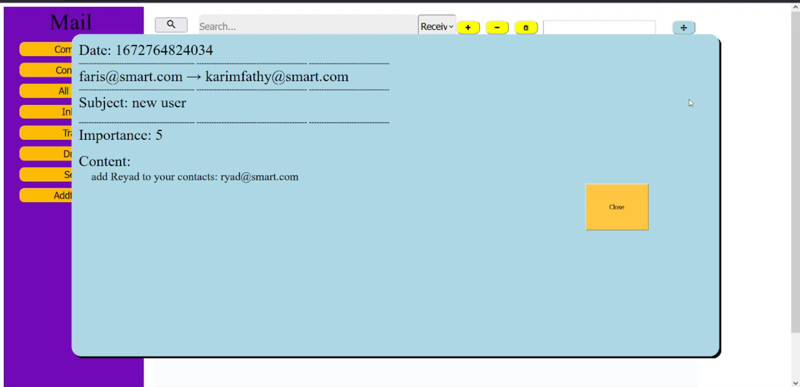
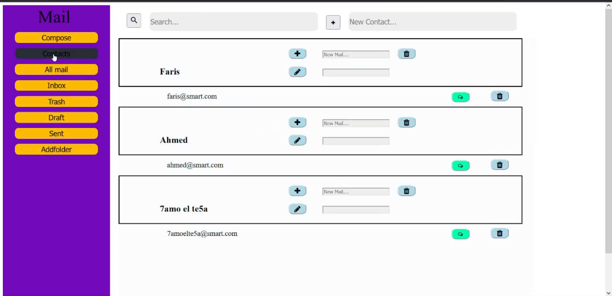
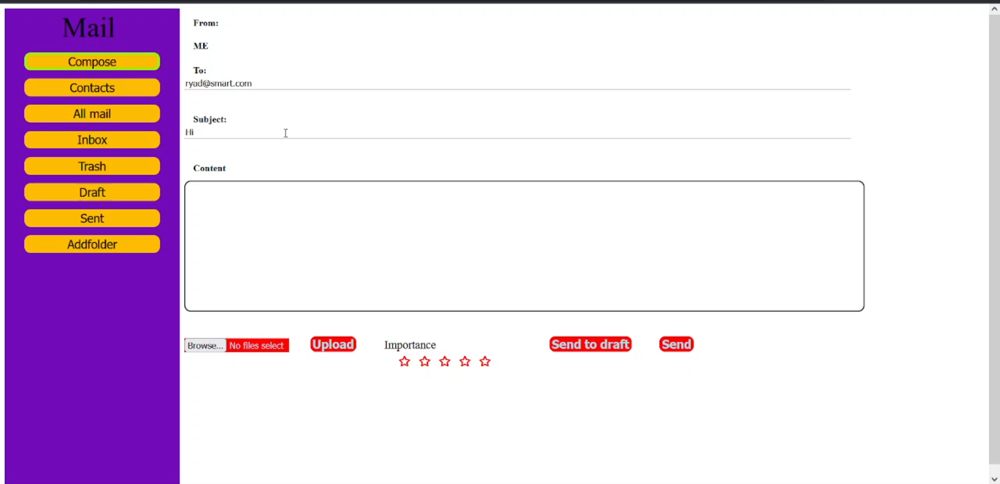

# simple-email-server

implementing a simple email server and a frontend user interface

## implementation details
- using Filter design pattern to filter messages according to date/sender/reciever/subject
- using command design pattern to handle end user commands as sort command
- using proxy design pattern to handle user login 

- **bussiness logic was implemented in java**

- **backend server is implemented using springboot**

- **frontend is made using angular framework**

- **We used `http:get`,`http:post`,`http:delete` and Restful api to handle front end requests**

## Screenshots

1. login page

2. all mail page

3. message contents

4. contacts page

5. message composing page

## People worked on this project

- **[Karim Fathy](https://github.com/karimfathy054)**
- **[Mohamed Reyad](https://github.com/moriyad12)**
- **[Ahmed M. Hassan](https://github.com/ahmedMhassan10)**
- **[Faris M. Anwar]()**
